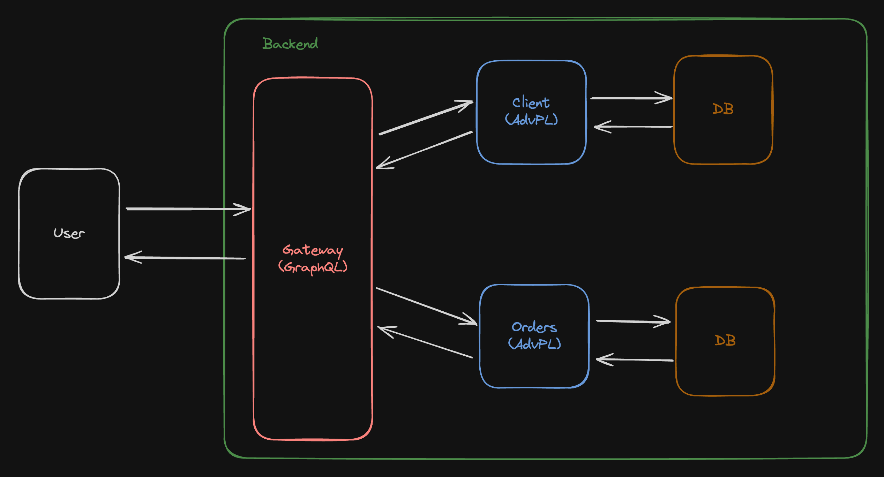

# AdvPL x GraphQL

### Introduction

This is project was development with intention to study concepts with: Clean Architecture, SOLID and MicroServices.

### Languages & Frameworks

- NodeJS
- AdvPL
- GraphQL

### Architecture



### Structure Folder

```
📁 server
    📁 gateway (GraphQL + NodeJS)
    📁 services
        📁 clientes (AdvPL)
        📁 sales-orders (AdvPL)

```

### How to Execute

#### Gateway

```
cd server/gateway
pnpm install
pnpm run dev
```

#### Services

```
cd server/services
Press CTRL + F9 into folder advpl/src
```